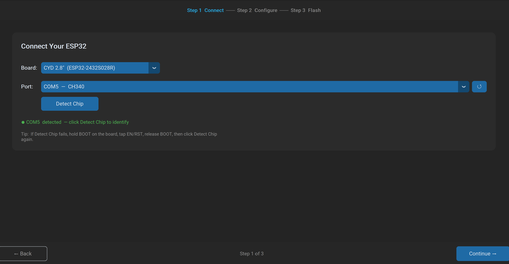
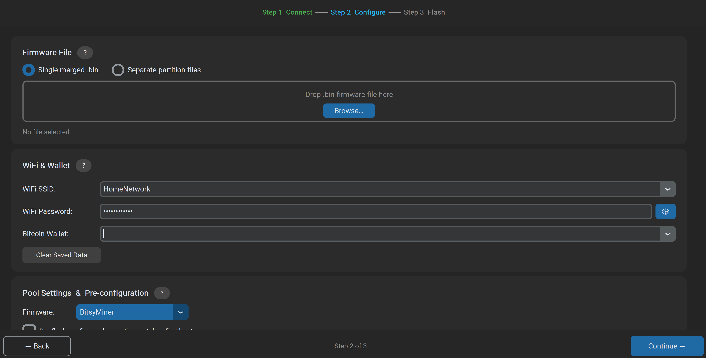
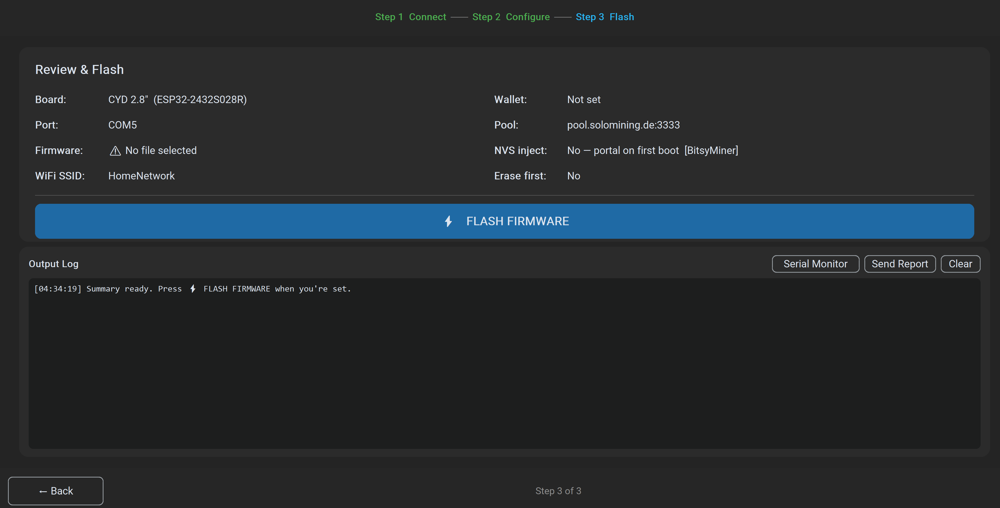

# ESP32 CYD Flasher

A Windows desktop app for flashing ESP32 CYD (Cheap Yellow Display) boards with Bitcoin mining firmware. Supports automatic port detection, drag-and-drop firmware loading, and pre-flash config injection — so your board connects to WiFi and starts mining on first boot with no captive portal setup required.

---

## Supported Firmware

| Firmware | Pre-config Support | Notes |
|---|---|---|
| [BitsyMiner](https://github.com/diyBitcoiner/bitsyminer) | WiFi + pool + wallet | NVS namespace `storage` |
| [SparkMiner](https://github.com/SneezeGUI/SparkMiner) | WiFi + pool + wallet | NVS blob `sparkminer/config` |
| [NerdMiner v2](https://github.com/BitMaker-hub/NerdMiner_v2) | WiFi + pool + wallet | WiFi via NVS, pool via SPIFFS |
| [NMMiner](https://nmminer.com) | WiFi + pool + wallet + license | Requires a paid license from nmminer.com |

---

## Features

- **Auto-detects** connected ESP32 boards via USB VID:PID
- **Chip detection** — reads chip type and flash size from the board before flashing
- **Drag & drop** firmware file loading
- **Single merged binary** or **separate partition files** mode (for NMMiner's 4-file layout)
- **Pre-flash config injection** — writes WiFi credentials, pool URL, and Bitcoin wallet directly to the chip so the board mines on first boot
- **Serial monitor** with NMMiner device-code detection and in-app license delivery
- **Field history** — remembers your last 8 SSIDs, wallets, and pool URLs
- **Pool compatibility warnings** — flags pools that won't work with ESP32 hash rates

---

## How It Works — 3-Step Wizard

### Step 1 — Connect
Select your board type. The app polls USB ports every 1.5 seconds and auto-detects CYD boards. Use **Detect Chip** to confirm the chip revision and flash size.

### Step 2 — Configure
- Drop your firmware `.bin` file into the box (or browse for it)
- Enter WiFi credentials and your Bitcoin wallet address
- Select the matching firmware family and your preferred pool
- Check **Pre-flash config** to have everything written at flash time

### Step 3 — Flash
Review the summary and hit **⚡ FLASH FIRMWARE**. The app flashes the firmware, then writes the config partition in a second pass. The board boots straight into mining.

---

## Supported Pools

The following pools are included in the dropdown and are compatible with ESP32-class miners (~25–40 kH/s):

| Pool | URL | Port |
|---|---|---|
| HMPool | hmpool.io | 3337 |
| HMPool (BTC) | btc.hmpool.io | 3337 |
| Public Pool | public-pool.io | 21496 |
| Seth for Privacy | pool.sethforprivacy.com | 3333 |
| NerdMiner.io | pool.nerdminer.io | 3333 |
| Solo Mining DE | pool.solomining.de | 3333 |
| NerdMiners Pool *(NerdMiner v2 only)* | pool.nerdminers.org | 3333 |

> High-difficulty pools like ocean.xyz and solo.ckpool.org are not listed — they set minimum difficulty that an ESP32 will never satisfy.

---

## Notes

- Tested on Windows 11 with CYD 2.8" (ESP32-2432S028R), CH340 USB bridge
- NMMiner requires a hardware-bound license from [nmminer.com](https://nmminer.com) — the app includes a serial monitor that captures the device code and delivers the license to the board after flashing
- WiFi credentials and wallet address are saved locally to `~/.espflasher_history.json`. Use the **Clear Saved Data** button in the app to wipe them.

---

## License

MIT — see [LICENSE](LICENSE)
